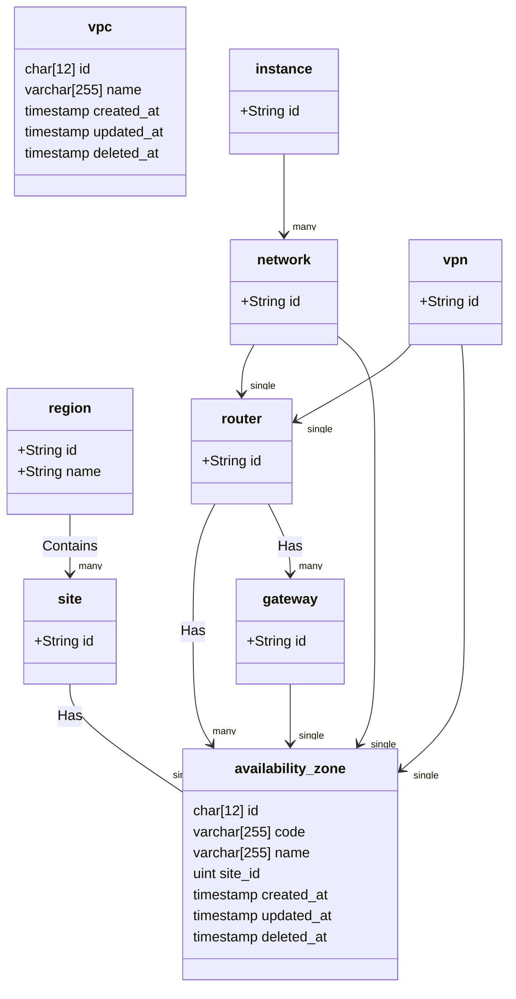

# Notes

- The DHCP server needs to be added in somewhere, but we need to know what is required. What needs to be federated? What needs to be configered by the customer? etc..
- Need VPN connections/properties confirming with JL and Joe
- Instance storage is not displayed on this UML but may in future
