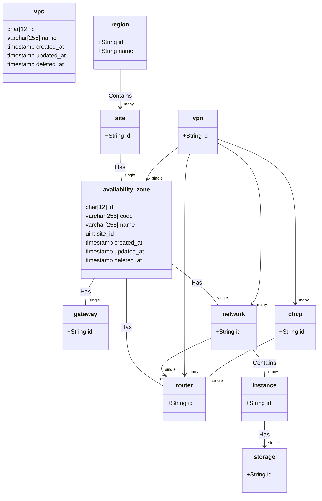

```mermaid
classDiagram
    class vpc {
        char[12] id
        varchar[255] name
        timestamp created_at
        timestamp updated_at
        timestamp deleted_at
    }

    class region {
        +String id
        +String name
    }
    region --> "many" site : Contains

    class site {
        +String id
    }
    site -- "single" availability_zone : Has

    class availability_zone {
        char[12] id 
        varchar[255] code
        varchar[255] name
        uint site_id
        timestamp created_at
        timestamp updated_at
        timestamp deleted_at
    }
    availability_zone -- "single" gateway : Has
    availability_zone -- "single" router : Has
    availability_zone -- "single" network : Has

    class gateway {
        +String id
    }

    class network {
        +String id
    }
    network --> "single" router
    network -- "many" instance : Contains

    class router {
        +String id
    }

    class vpn {
        +String id
    }
    vpn --> "many" router
    vpn --> "many" dhcp
    vpn --> "many" network
    vpn --> "single" availability_zone

    class dhcp {
        +String id
    }
    dhcp -- "single" router

    class instance {
        +String id
    }
    instance --> "single" storage : Has

    class storage {
        +String id
    }
```
